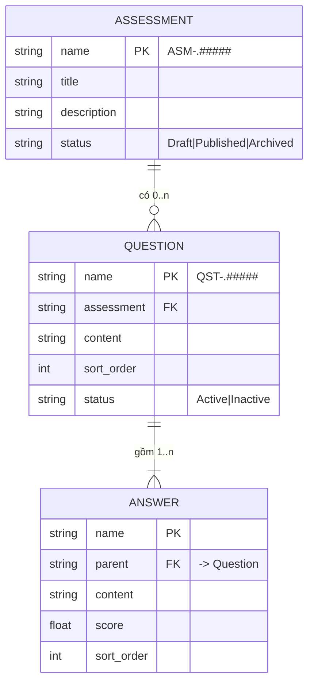

# Assessment Hub

App Frappe Framework v16 quản lý bài đánh giá theo cấu trúc Assessment, Question, Answer.

## Yêu cầu môi trường

| Thành phần | Phiên bản tối thiểu | Đã test trên |
| --- | --- | --- |
| Frappe Framework | version-16 | 16.34.0 |
| Python | 3.14, dưới 3.15 | 3.14.7 |
| Node.js | 24 | 24.21.0 |
| Yarn | 1.22 | 1.22.22 |
| MariaDB | 10.6 (utf8mb4) | 10.11.14 |
| Redis | 6 | 7.0.15 |

Frappe v16 khoá cứng `requires-python = ">=3.14,<3.15"` và `engines.node = ">=24"`.
Python 3.11, 3.12 hoặc Node 20 sẽ không cài được app này.

## Cài đặt

### Bước 1. Chuẩn bị bench

Bỏ qua bước này nếu bạn đã có sẵn một bench chạy Frappe v16.

```bash
# Runtime
uv python install 3.14
nvm install 24 && nvm use 24
npm install -g yarn
uv tool install frappe-bench

# Bench mới
#  mkdir frappe-bench && cd frappe-bench
#  bench init --frappe-branch version-16 --python "$(which python3.14)" --ignore-exist .
cd ~
bench init --frappe-branch version-16 --python "$(uv python find 3.14)" frappe-bench
cd frappe-bench
```

### Bước 2. Tạo site

```bash
bench new-site dev.localhost \
  --db-root-password '<mật khẩu root MariaDB>' \
  --admin-password '<mật khẩu Administrator>' \
  --mariadb-user-host-login-scope='%'

bench use dev.localhost
```

### Bước 3. Lấy app từ repo

```bash
bench get-app https://github.com/TienPhuc02/assessment_hub.git
```

Lấy theo tag hoặc branch cụ thể:

```bash
bench get-app --branch main https://github.com/TienPhuc02/assessment_hub.git
```

### Bước 4. Cài app lên site

```bash
bench --site dev.localhost install-app assessment_hub
bench --site dev.localhost migrate
```

### Bước 5. Build assets

```bash
nvm use 24
bench build --app assessment_hub
```

### Bước 6. Chạy

```bash
bench start
```

Mở http://dev.localhost:8000 và đăng nhập bằng user `Administrator`.

Nếu cổng 8000 đã bị chiếm, bench sẽ tự chọn cổng khác. Kiểm tra bằng:

```bash
grep webserver_port sites/common_site_config.json
```

## Kiểm tra cài đặt

```bash
# App có trong danh sách của site
bench --site dev.localhost list-apps

# Phiên bản frappe đang chạy
bench version
```

Kết quả mong đợi của `list-apps`:

```
frappe          16.34.0 version-16
assessment_hub  0.0.1
```

## Gỡ cài đặt

```bash
# Gỡ khỏi site
bench --site dev.localhost uninstall-app assessment_hub

# Gỡ khỏi bench
bench remove-app assessment_hub
```

## Kiến trúc dữ liệu



### Answer là Child Table của Question

**Lý do.** Answer không có ý nghĩa khi tách khỏi Question. Nhập trên grid ngay trong form
Question nhanh hơn mở từng form riêng. Một lần `doc.insert()` ghi Question và toàn bộ Answer
trong cùng một transaction nên tính atomic là tự nhiên, không phải viết thêm code. Answer kế
thừa quyền của Question, không bao giờ mồ côi, xoá Question là xoá sạch Answer đi kèm.

**Đánh đổi.** Không phân quyền riêng cho từng Answer. DocType khác không Link trực tiếp tới
một Answer được. Sửa một Answer phải save lại cả Question.

**Khi nào nên đổi sang Standalone.** Khi cần ngân hàng đáp án dùng lại giữa nhiều câu hỏi,
hoặc khi có bảng kết quả làm bài cần Link tới từng Answer cụ thể.

### Question là Standalone DocType, không phải Child Table của Assessment

**Lý do.** Question cần `status` và `sort_order` riêng, cần List View và form riêng cho luồng
thêm câu hỏi, cần API list và create độc lập. Quan trọng nhất: Frappe không hỗ trợ child table
lồng trong child table, nên nếu Question là child của Assessment thì Answer không thể là child
của Question nữa.

**Đánh đổi.** Phải kiểm tra Link và phân quyền ở cả hai DocType thay vì một.

## Chống XSS trên Desk

Hai lớp độc lập, không chỉ dựa vào một chỗ:

1. **Server (Frappe core, không phải code của app).** Mọi field kiểu Data/Small Text/Text
   (trừ Email, Attach, Barcode, Code) tự động chạy qua `sanitize_html()` trước khi ghi vào
   database (`Document._validate()` → `_sanitize_content()`), xoá attribute như `onerror`,
   `onclick` bằng allowlist. `title`, `content` (Question/Answer) đều thuộc nhóm này — đây là
   lý do ADR-04 chọn Small Text thay vì Text Editor.
2. **Client (`assessment.js`).** Giá trị người dùng ghép vào `frappe.confirm`/`__()` (ví dụ
   title khi hỏi xác nhận Publish/Archive) đi qua `frappe.utils.escape_html()` trước, vì `__()`
   không tự escape tham số.

Kiểm bằng payload `` ở title/content/answer content.

## Partner REST API v1

Đang xây dần theo từng endpoint (FR-14 đến FR-17); phần dưới đây là **hợp đồng chung**, đã cố
định và có code thật (`assessment_hub/api/utils.py`), không phụ thuộc endpoint nào.

### Xác thực

Header `Authorization: token <api_key>:<api_secret>`. Không có `allow_guest=True` ở bất kỳ
endpoint nào — thiếu token bị Frappe từ chối như Guest không đủ quyền, sai token bị từ chối ở
tầng xác thực trước khi vào code của app.

```bash
curl -H "Authorization: token <api_key>:<api_secret>" \
  http://dev.localhost:8000/api/v2/method/assessment_hub.api.v1.assessments.list_assessments
```

Sinh API key/secret cho một user:

```bash
bench --site dev.localhost console
```

```python
user = frappe.get_doc("User", "partner@example.com")
api_secret = frappe.generate_hash(length=15)
user.api_key = frappe.generate_hash(length=15)
user.api_secret = api_secret
user.save(ignore_permissions=True)
frappe.db.commit()
print(user.api_key, api_secret)  # api_secret chỉ hiện lúc này, không đọc lại được
```

### Định dạng response

Thành công: HTTP 200, `{"data": ...}`. Thất bại: HTTP 4xx/5xx,
`{"errors": [{"message": "...", "code": "..."}]}`. Mọi endpoint bọc bằng decorator
`@api_response` (`api/utils.py`), tự bắt exception và dựng đúng hai dạng trên.

| HTTP | code | Khi nào |
| --- | --- | --- |
| 400 | MISSING_REQUIRED_FIELD | Thiếu tham số bắt buộc |
| 400 | INVALID_PARAMETER | Sai kiểu, sai enum, vượt giới hạn, sai định dạng ngày |
| 400 | VALIDATION_ERROR | Vi phạm rule dữ liệu trong controller |
| 401 | AUTHENTICATION_FAILED | Token sai/thiếu định dạng |
| 403 | PERMISSION_DENIED | Không đủ quyền (kể cả gọi ẩn danh, xem giới hạn bên dưới) |
| 404 | NOT_FOUND | Bản ghi không tồn tại |
| 405 | METHOD_NOT_ALLOWED | Sai HTTP method |
| 422 | ASSESSMENT_ARCHIVED | Thêm/sửa Question của Assessment đã Archived |
| 500 | INTERNAL_ERROR | Lỗi không lường trước, đã ghi Error Log, không lộ traceback |

### Giới hạn đã biết (R-02)

Lỗi 401 (token sai) và 405 (sai HTTP method) phát sinh ở tầng xác thực/định tuyến của Frappe,
**trước khi** request tới được `@api_response` — body trả về là định dạng lỗi mặc định của
Frappe, không phải `{"errors": [...]}`. Đã kiểm chứng bằng `curl` thật: token sai trả về
`{"exception": "...AuthenticationError", ...}` kèm traceback, không phải hai dòng
`message`/`code` như các lỗi khác.

**Thiếu token hẳn (không có header) trả 403, không phải 401** — request không có
`Authorization` được Frappe xử lý như user `Guest`, và `Guest` không có quyền gọi endpoint
không `allow_guest`, nên rơi vào `PermissionError` (403) chứ không phải `AuthenticationError`
(401). Chỉ token **sai định dạng hoặc sai giá trị** mới ra đúng 401.

## License

MIT, xem [license.txt](license.txt).
